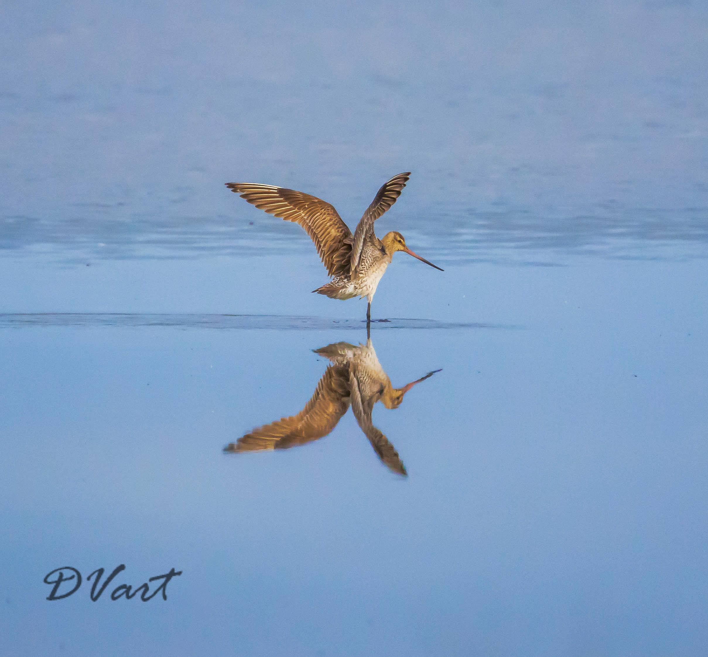
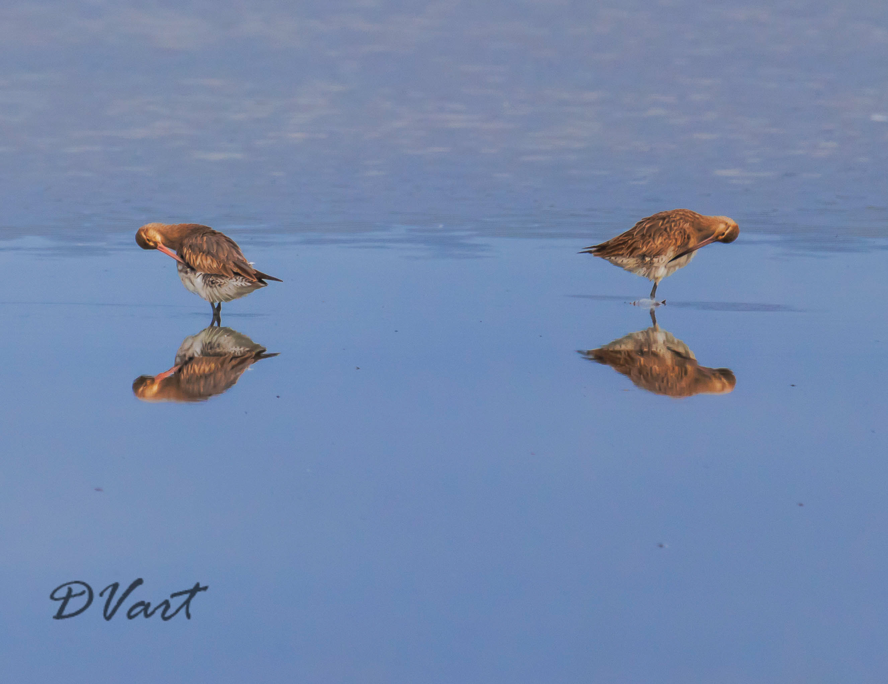

We arrived at Miranda about 8am the morning after a large flock of Bar tailed Godwits arrived after their ten day non stop flight from Alaska.  Several of the birds in the flock had GPS trackers on them.

I was very lucky to be standing next to the Miranda park ranger who had set up a high quality spotting scope.  
The ranger pointed out the various birds including a single beared turn who turned up a year ago and has not yet left.  
  
The flock spent most of the time prenning and resting.  
I waited quite a while and took many shots to get this one where the two birds beaks are facing each other. The Bartailed Godwits are mirrored in the water and are mirror images of themselves.

